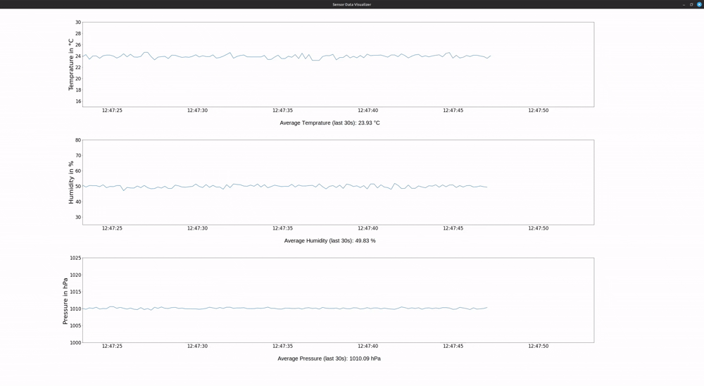
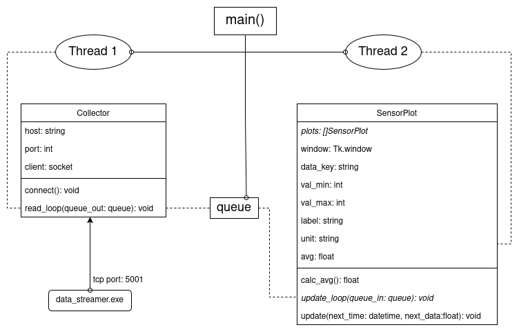

# Sensor-Visualizer



Das Tool 'Sensor-Visualizer' verbindet sich mit dem lokal laufenden TCP-Server und liest die dort bereitgestellten Messungen aus. Die Messdaten werden dann in der GUI übersichtlich mit dem Durchschnitt der letzten 30 Sekunden dargestellt.

## Installation und Ausführung
Voraussetzungen zum Ausführen:
 - Python3 
 - `data_streamer.exe`
 - (git, falls man das Projekt von github clonen möchte)

Folgende Schritte sind für das Ausführen notwendig:

 1. `data_streamer.exe` starten 

    ```
        cd <Verzeichnis mit data_streamer.exe>
        
        ./data_streamer.exe
    ```
    
    Unter Linux:
    ```
        apt install wine
        
        cd <Verzeichnis mit data_streamer.exe>
        
        wine data_streamer.exe
    ```

 2. In einem *separaten* Terminal Repository herunterladen und Projekt starten

    ```bash
        cd <beliebiges Verzeichnis>
        
        git clone git@github.com:Julian-Beck/sensor-visualizer.git
        
        cd sensor-visualizer
        
        python3 main.py
    ```

## Architektur

UML-ähnliches Diagramm der Architektur:


Es gibt drei wichtige Akteure:
 - Ein `Collector`, welcher sich mit dem TCP-Port des "data_streamers verbindet
 
 - Mehrere `SensorPlots`, welche jeweils einen Datengraphen beinhalten und einer statischen Methode zum gleichzeitigen Update aller `SensorPlots`

 - Die `main()` Funktion, welche zwei separate Threads startet für den `Collector` und die statische Methode der `SensorPlots`-Klasse. Außerdem wird hier auch die `queue` erstellt, über die es möglich ist, Daten von einem zum anderen Thread zu schicken.

 ## Code
 - `Collector.read_loop(queue)`: Hier verbindet sich der Collector mit dem TCP Port und startet eine while-Schleife, welche dauerhaft den Port 5001 beobachtet und die Messdaten entgegennimmt. Wenn ein neuer Datensatz empfangen wurde, wird dieser in ein Dictionary umgewandelt und zur `queue` hinzugefügt.

 ```python
 def read_loop(self, queue_out):
        while True:
            recv_data = self.client.recv(1024).decode('utf-8')

            (...)
            
            queue_out.put(data)
 ```


 - `SensorPlot.update_loop()`: Startet eine while-Schleife, welche die Dictionaries aus der `queue` liest und damit alle existierenden SensorPlot-Instanzen aktualisiert.

 ```python
 @staticmethod
    def update_loop(queue_in: queue.Queue):
        while True:
            try:
                next_data: dict = queue_in.get(timeout=1)
                for plot in SensorPlot.plots:
                    plot.update(...)
            except queue.Empty:
                pass
 ```

 - Weitere Erklärungen sind im Code als Kommentar

# Ressourcen
- [Python `Queue` for data transfer between threads](https://docs.python.org/3/library/queue.html)

- [`matplotlib.backends` for embedding plotted graphs into tkinter](https://www.geeksforgeeks.org/python/how-to-embed-matplotlib-charts-in-tkinter-gui/)

- [`datetime` library to parse timestamp data](https://docs.python.org/3/library/datetime.html#strftime-and-strptime-behavior)

- [Python `static` methods](https://www.geeksforgeeks.org/python/python-staticmethod/)

 - [Python `dataclasses`](https://docs.python.org/3/library/dataclasses.html)
